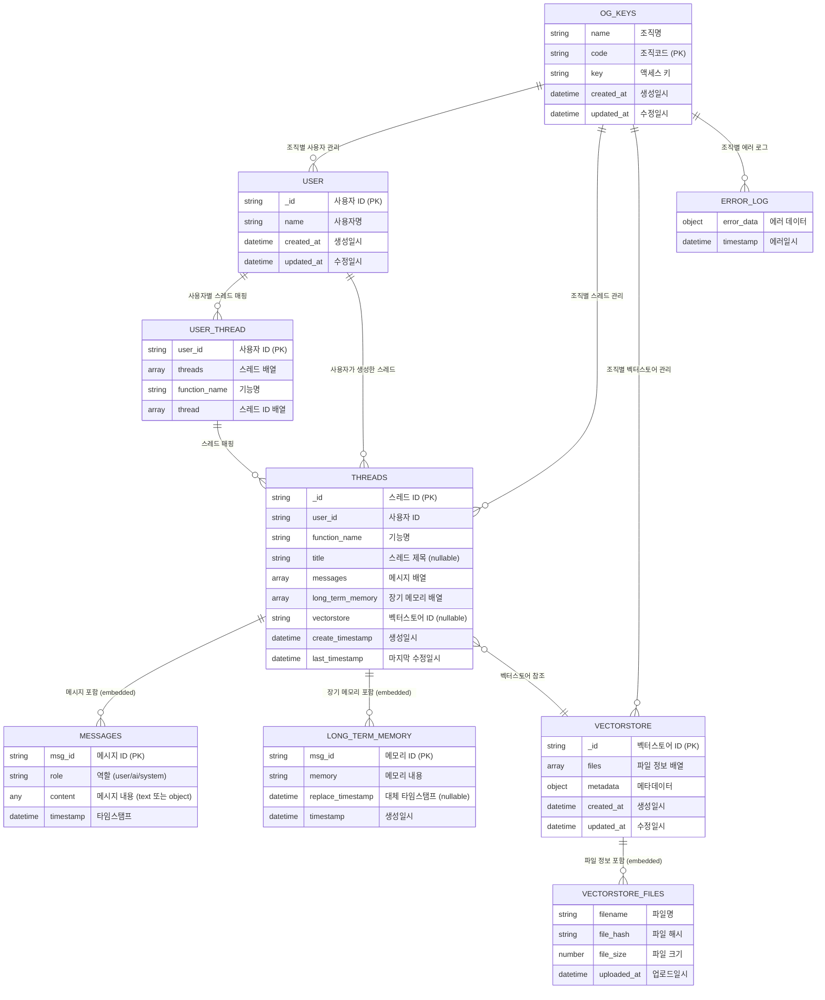

# MongoDB ERD - NSP Chatbot System

이 문서는 NSP Chatbot 시스템의 MongoDB 데이터베이스 구조를 Mermaid ERD로 표현합니다.

## 시스템 개요

MongoDB는 조직(Organization) 기반으로 데이터베이스를 분리하며, 각 조직별로 독립적인 컬렉션들을 관리합니다.

## ERD 다이어그램



## 컬렉션 상세 설명

### 1. 전역 컬렉션

#### og_keys.og_keys
- **목적**: 조직 인증 정보 관리
- **특징**: 모든 조직의 액세스 키를 중앙 관리
- **보안**: 조직별 접근 권한 제어

### 2. 조직별 컬렉션 (각 조직코드별 데이터베이스)

#### user
- **목적**: 조직 내 사용자 관리
- **특징**: 간단한 사용자 정보만 저장

#### user_thread
- **목적**: 사용자와 스레드 간 매핑 관리
- **특징**: 사용자별 기능별 스레드 목록을 배열로 관리

#### threads
- **목적**: 채팅 스레드 및 대화 컨텍스트 관리
- **특징**: 
  - 메시지와 장기 메모리를 직접 임베디드
  - 단일 기능별 스레드 관리
  - 벡터스토어 참조 가능 (nullable)
  - 제목은 선택적 (처음에는 null, 후에 업데이트 가능)

#### vectorstore
- **목적**: RAG를 위한 벡터 데이터 관리
- **특징**: 
  - 파일 정보를 배열로 임베디드
  - 메타데이터 지원

### 3. 로그 컬렉션

#### error_log
- **목적**: 시스템 에러 추적


## 데이터 구조 특징

### 1. 멀티테넌트 아키텍처
- 조직별 완전 분리된 데이터베이스
- og_keys를 통한 중앙 인증 관리

### 2. 임베디드 vs 참조
- **임베디드**: messages, long_term_memory, files (강한 관계)
- **참조**: vectorstore (약한 관계, 재사용 가능, nullable)

### 3. 단순화된 구조
- **서브펑션 제거**: 스레드당 하나의 기능만 관리
- **AI 로그 제거**: 시스템 로그를 최소화하여 성능 향상

### 4. 타임스탬프 관리
- 생성, 수정, 마지막 접근 시간 추적
- 로그 데이터의 시간 기반 쿼리 최적화

### 5. 유연한 스키마
- 메시지 content: Any 타입으로 text 또는 object 형태 지원
- 메타데이터: 확장 가능한 구조
- Nullable 필드들: title, vectorstore, replace_timestamp

## 성능 고려사항

### 인덱스 권장사항
```javascript
// user_thread 컬렉션
db.user_thread.createIndex({ "user_id": 1 })

// threads 컬렉션
db.threads.createIndex({ "user_id": 1, "function_name": 1 })
db.threads.createIndex({ "last_timestamp": -1 })

// 로그 컬렉션들
db.error_log.createIndex({ "timestamp": -1 })
```

### 데이터 라이프사이클
- 에러 로그: 30일 자동 삭제 (설정 가능)
- 스레드 데이터: 사용자 관리
- 벡터스토어: 명시적 삭제